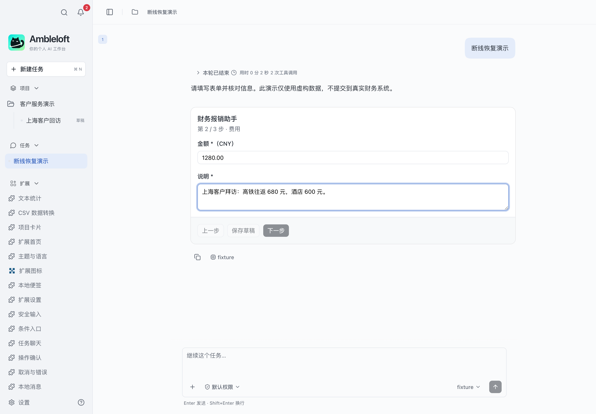

# Ambleloft 扩展示例

[English](README.md) · **简体中文**

从可运行的独立案例学习业务操作、项目聊天、表单、消息推送和企业服务连接。**重点案例：[差旅报销助手](expense-workflow/README.zh-CN.md)**，涵盖三步办理、记录查询和写后丢响应恢复。



*真实 Ambleloft 桌面，本机模拟服务与模拟模型；仅使用虚构数据。*

## 聊天内界面：先区分两种方式

- **宿主渲染表单**：扩展声明 YAML，宿主绘制字段和步骤。入门看 [declarative-intake](declarative-intake/README.zh-CN.md)，业务流程看 [expense-workflow](expense-workflow/README.zh-CN.md)。
- **扩展页面通过 iframe 渲染**：扩展提供 HTML/CSS/JavaScript，宿主在聊天中嵌入页面。看 [mcp-apps-card](mcp-apps-card/README.zh-CN.md)。

[对照说明、调用流程与截图](docs/chat-ui-rendering.zh-CN.md)。独立扩展首页是另一个展示位置，不等同于聊天 iframe。

## 开始

SDK/CLI `0.1.0-alpha.7` 已在 npm 发布。Node ≥22.13。克隆后进入任一案例运行 `npm ci`、`npm run build`、`npm run validate`、`npm test`、`npm run pack`。每个目录有独立 lockfile，不依赖相邻仓库。

从空目录使用官方模板：

```sh
npm create ambleloft-extension@0.1.0-alpha.7 my-expense -- --template expense
```

官方模板是起点，本仓库旗舰还增加了查询首页及独立验收。

## 案例目录

| Sample | 用途 | 状态 |
| --- | --- | --- |
| [文本统计](hello-operation/README.zh-CN.md) | 让页面和 Agent 调用同一个文本统计工具。 | preview |
| [CSV 数据转换](npm-data-transform/README.zh-CN.md) | 粘贴 CSV，使用打包的 npm 依赖解析数据。 | preview |
| [项目卡片](project-card/README.zh-CN.md) | 选择并授权项目，查看名称和说明。路径访问单独授权。 | preview |
| [扩展首页](extension-home/README.zh-CN.md) | 从独立页面调用后台，查看业务记录。 | preview |
| [主题与语言](theme-and-i18n/README.zh-CN.md) | 切换宿主语言和主题，观察页面的变化。 | preview |
| [扩展图标](extension-icons/README.zh-CN.md) | 在宿主侧栏和扩展详情中查看浅深主题图标。 | preview |
| [本地便签](storage-notebook/README.zh-CN.md) | 先读取版本，再保存修改。另一个窗口的修改不会被静默覆盖。 | preview |
| [扩展设置](configuration/README.zh-CN.md) | 在扩展设置修改数量和备注，再查询后台观察到的变化。 | preview |
| [安全输入](secret-input/README.zh-CN.md) | 通过宿主输入虚构密钥。此页面只知道密钥是否存在。 | preview |
| [条件入口](contextual-entry/README.zh-CN.md) | 关联任务后显示额外入口，解除关联后隐藏。 | preview |
| [任务聊天](conversation-launcher/README.zh-CN.md) | 为授权项目创建聊天草稿，再按 ID 打开原聊天。草稿不会自动运行模型。 | preview |
| [操作确认](operation-confirmation/README.zh-CN.md) | 添加或删除本地记录，观察宿主的写入确认。 | preview |
| [取消与错误](cancellation-and-errors/README.zh-CN.md) | 启动慢读取，再取消等待。取消不代表回滚业务。 | preview |
| [本地消息](local-messages/README.zh-CN.md) | 发布、查询、更新和撤回同一条业务进展消息。 | preview |
| [团队信息收集](declarative-intake/README.zh-CN.md) | 在聊天中填写七种字段，确认后发送到当前聊天。 | preview |
| [企业服务连接](enterprise-auth/README.zh-CN.md) | 通过宿主连接企业账号，再读取已声明的 HTTPS 服务。 | preview |
| [消息业务操作](message-actions/README.zh-CN.md) | 从消息提交任务，再查询服务结果。未知写入不自动重试。 | preview |
| [业务消息推送](service-events/README.zh-CN.md) | 连接本机 SSE 服务，把版本化任务事件发布到消息中心。 | preview |
| [聊天内差旅卡片](mcp-apps-card/README.zh-CN.md) | 在聊天内修改差旅记录，确认后保存到扩展本地。 | preview |
| [团队工作台](team-workbench/README.zh-CN.md) | 关联项目、多个业务任务和聊天，继续原来的讨论。 | preview |
| [扩展能力体验馆](extension-showcase/README.zh-CN.md) | 体验项目、表单、消息、业务操作和企业连接。 | preview |
| [差旅报销助手](expense-workflow/README.zh-CN.md) | 在聊天里填写、核对并提交报销，断线后也能核实结果。 | preview |
| [提交结果核实](submission-recovery/README.zh-CN.md) | 注入丢响应故障，再只读核实原提交结果。 | preview |
| [聊天进展观察器](conversation-events/README.zh-CN.md) | 等待宿主公开聊天事件及轮次读取接口。 | planned |
| [聊天结果同步](conversation-business-sync/README.zh-CN.md) | 等待宿主公开聊天事件及轮次读取接口。 | planned |

23 个可构建预览案例，2 个等待 M2 的规划目录。preview 不代表所有桌面流程均已验收；实际覆盖范围见 [验证记录](docs/verification.md)。企业认证默认使用占位资源，真实 IdP 需要配置。

```sh
# Maintain all samples / 批量维护
npm ci
npm run setup
npm run build
npm run validate
npm run pack
npm test
```

[需求](docs/requirements.md) · [兼容性](docs/compatibility.md) · [贡献说明](CONTRIBUTING.md) · [许可证](LICENSE)
