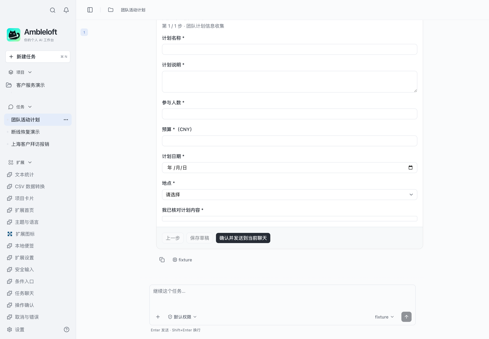
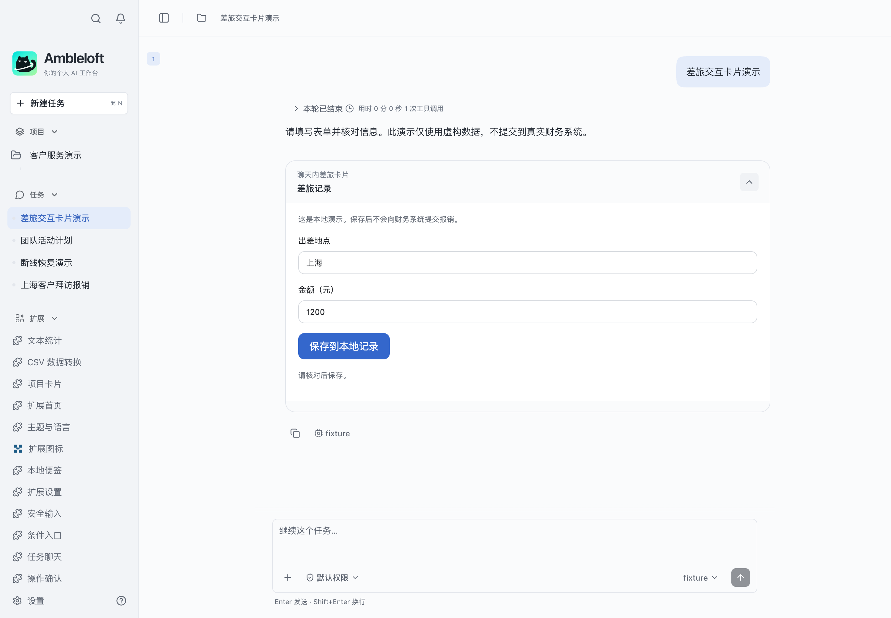

# Two ways to render interactive UI in chat

**English** · [简体中文](chat-ui-rendering.zh-CN.md)

Ambleloft supports **host-rendered declarative forms** and **extension-provided HTML pages embedded in a host iframe**. Both appear in chat. The distinction is who implements the UI, not whether it contains form fields. The agent triggers the appropriate tool; it does not draw the controls.

| Question | Host-rendered form | Extension page in an iframe |
| --- | --- | --- |
| What do you author? | YAML fields, steps, submission behavior and operation mappings | HTML/CSS/JavaScript and associated business operations |
| Who renders the controls? | Host form components | Extension HTML; the host provides an isolated iframe |
| How does it open? | Agent calls host `forms_list` and `forms_present` tools | Agent calls a `render` operation with UI resource metadata |
| How is it declared? | A Skill references YAML through `amble-form-ref` | `contributes.mcpApps` declares the resource; operation `_meta.ui.resourceUri` links it |
| Who manages interaction? | Host manages fields, steps and form instances, then performs the declared submission | Page manages DOM and interaction, requesting operations through the MCP Apps protocol |
| Communication | Host interprets the declaration; extension implements referenced handlers | `ui/initialize`, `ui/notifications/tool-result`, and `tools/call` |
| When should I choose it? | Existing field types and steps fit data collection or business submission | Custom layouts, controls or interaction logic are required |
| Start here | [Declarative intake](../declarative-intake/README.md) | [MCP Apps card](../mcp-apps-card/README.md) |
| Advanced example | [Expense workflow](../expense-workflow/README.md), [submission recovery](../submission-recovery/README.md) | `mcp-apps-card` demonstrates the currently supported protocol subset |

## Host-rendered form

The host renders these controls from [intake.yaml](../declarative-intake/skills/intake/intake.yaml). You do not author HTML for this chat form.

Flow: user request → agent finds and presents a form → host renders it → user fills and confirms → host performs the declared submission. Intake sends the values to the current chat; the expense workflow maps values to backend operations.

The expense definition is [travel.yaml](../expense-workflow/skills/expense/forms/travel.yaml); handlers live in [main.ts](../expense-workflow/src/main.ts). The host manages form instances and submission states. Business persistence, idempotency and result lookup remain responsibilities of the service.

## Extension page rendered in an iframe

The extension's [form.html](../mcp-apps-card/form.html) implements this layout and its controls. Having input fields does not make it a host-rendered YAML form.

Flow: agent calls `samples.mcp-apps-card.render` → host resolves the UI resource and loads packaged HTML in an iframe → page initializes and receives the tool result → user edits → page requests `save` using `tools/call` → host confirms and invokes the backend operation → page shows the result.

See [extension.json](../mcp-apps-card/extension.json) for resource mappings and [main.cjs](../mcp-apps-card/main.cjs) for handlers. This example writes extension-local storage, not a finance system. The iframe does not grant business permissions: host authorization and confirmation still apply.

## An extension home is a separate surface

`extension-home` and the expense service/records home are independent extension pages using the SDK `@ambleloft/extension-sdk/webview` bridge. Chat MCP Apps pages use their UI protocol. Do not interchange their initialization or invocation code.

The expense example combines an independent home with a host-rendered chat form; it does not implement an iframe expense form. `mcp-apps-card` is the minimal chat iframe example and has no independent home.

There is currently no public extension-home SDK API to directly present or resume a form. Follow the example prompts so the agent calls the host form tools. Chat rendering does not imply chat event subscriptions.

These are existing real desktop captures with fictional data. See [verification](verification.md) and [known gaps](gaps.md) for scope and limitations.
