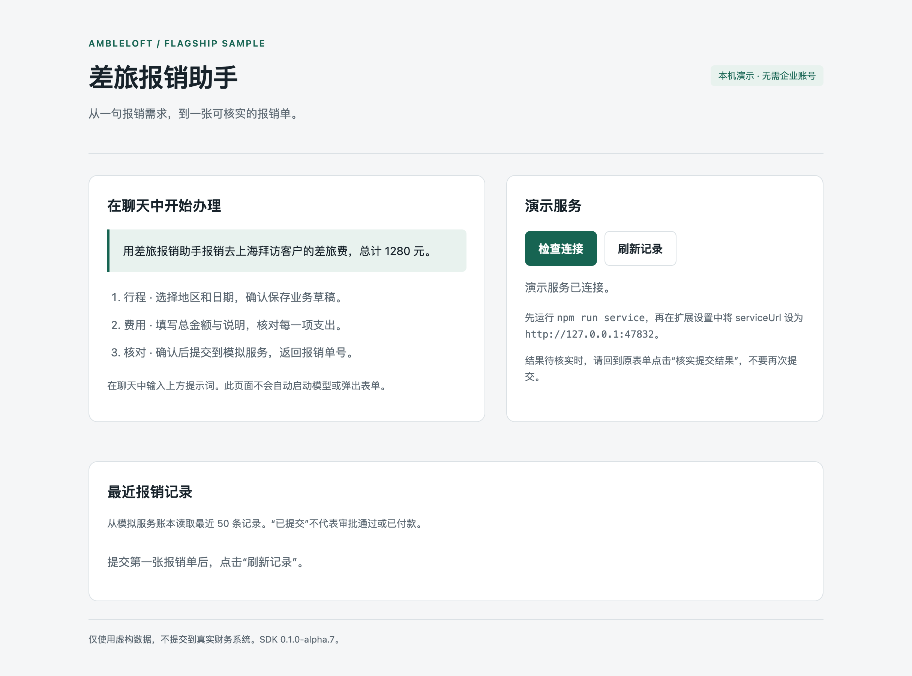
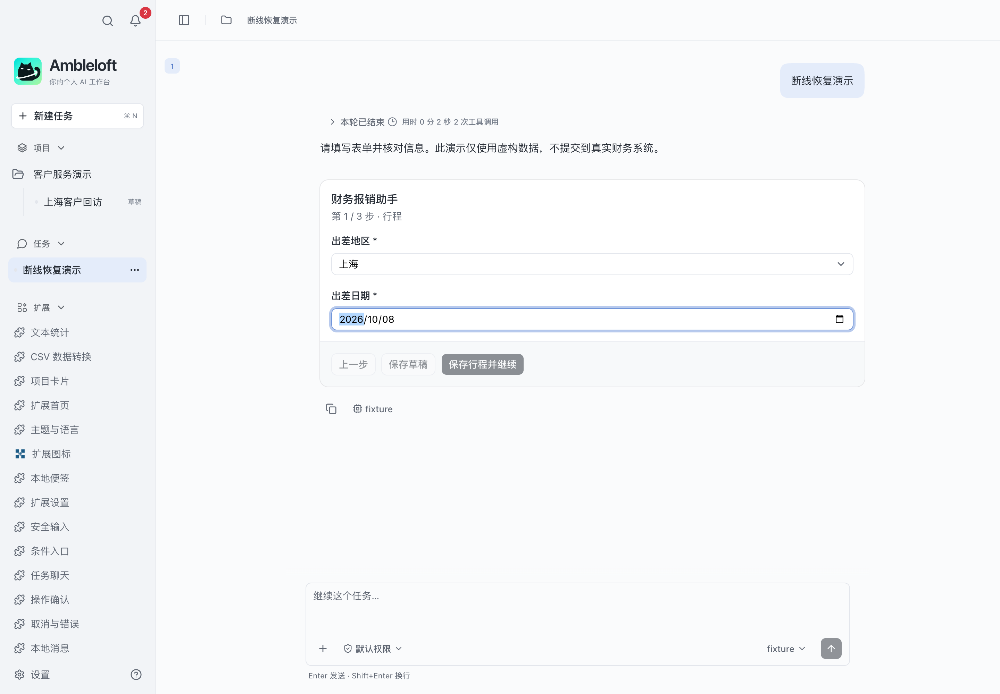
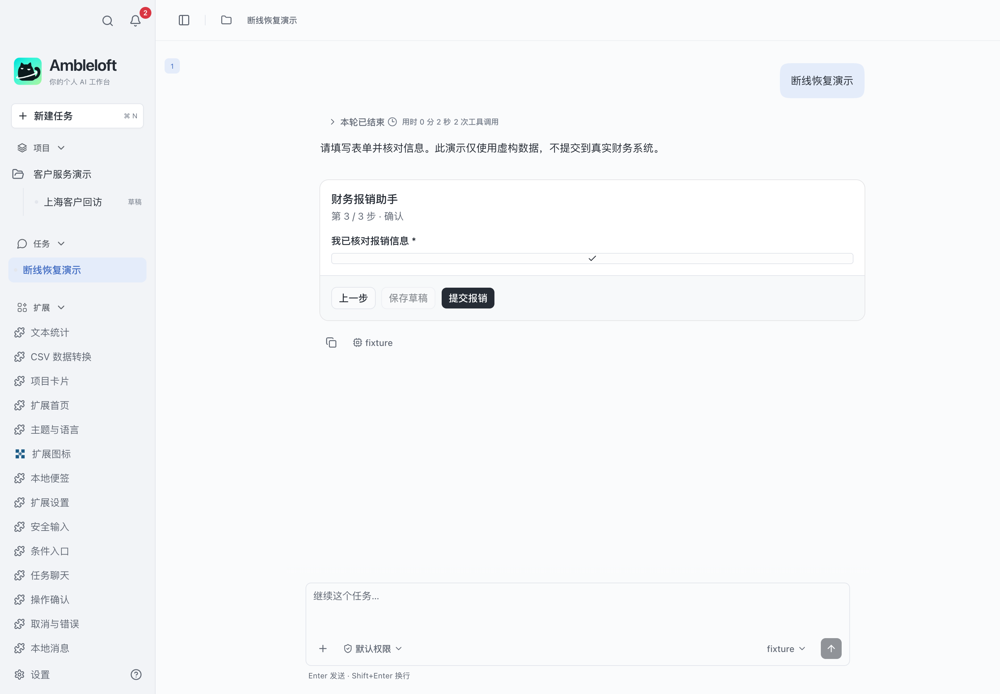
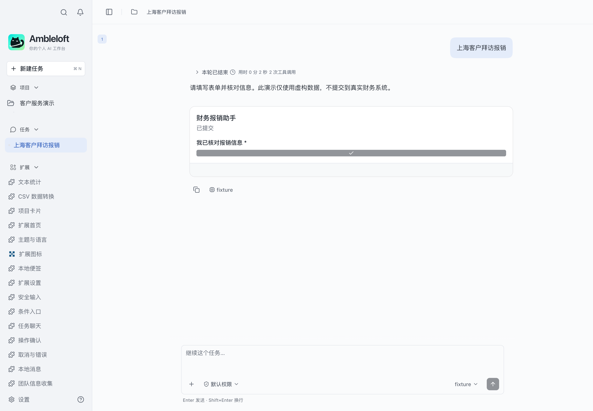
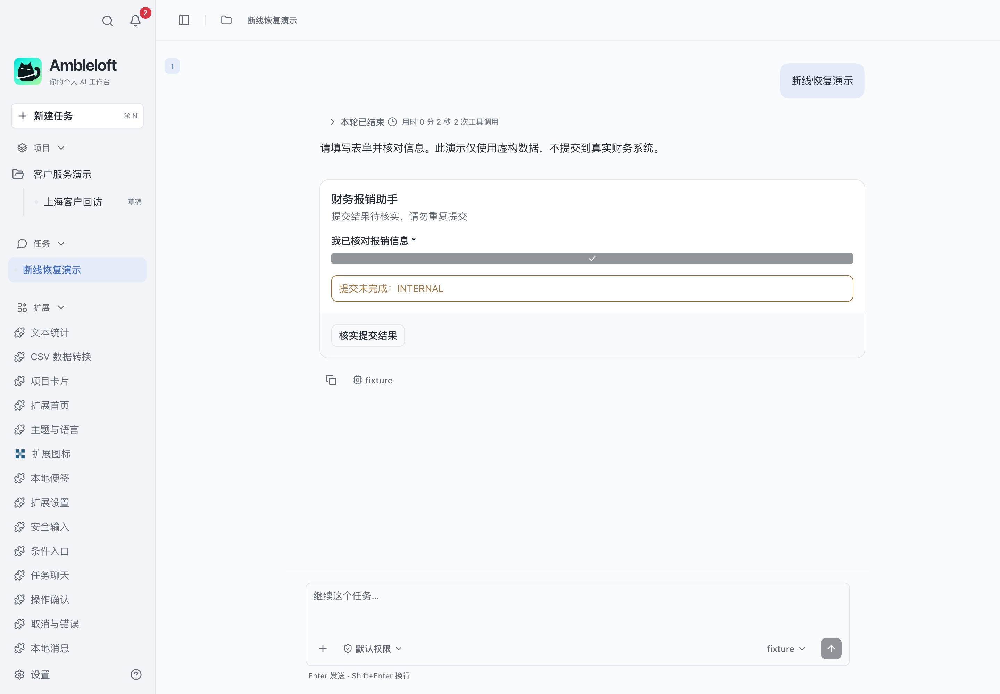
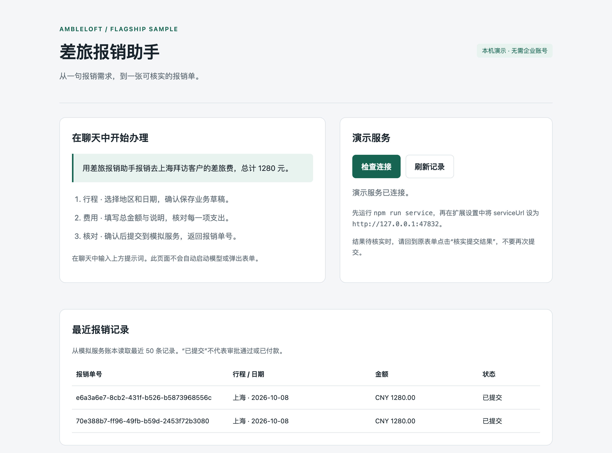
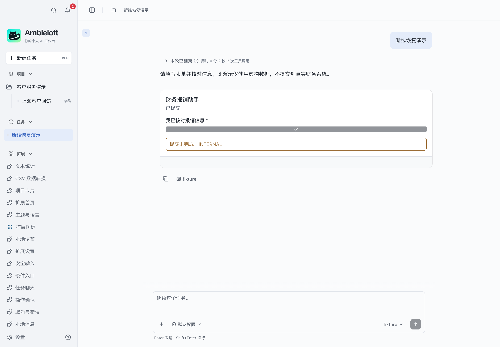
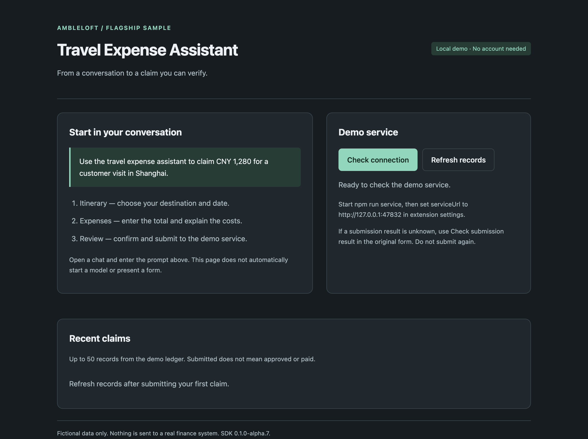

# 差旅报销助手

[English](README.md) · **简体中文**

在聊天里填写、核对并提交报销，断线后也能核实结果。

## 运行

需要 Node.js ≥22.13 和支持扩展的 Ambleloft。SDK/CLI 从 npm 安装，版本固定为 `0.1.0-alpha.7`，无需相邻源码仓库。

```sh
cd expense-workflow
npm ci
npm run build
npm run validate
npm test
npm run pack
```

在宿主 **设置 → 扩展 → 安装扩展** 选择 `dist/expense-workflow.amble-extension`，信任后按提示授权，再打开扩展首页。安装包 ID 为 `samples.expense-workflow`。

## 体验步骤

先运行 `npm run service`，在设置 → 扩展 → 差旅报销助手 → 设置中保存 `serviceUrl=http://127.0.0.1:47832`。在聊天输入“用差旅报销助手报销去上海拜访客户的差旅费，总计 1280 元”。填写行程、费用和核对确认；宿主确认后返回单号。首页可检查服务并刷新记录。

## 截图与验证

以下图片采集自 macOS 上的真实 Ambleloft 桌面，使用隔离 profile、虚构数据、本机模拟服务和确定性模拟模型。扩展页面截图来自实际隔离 WebContents；表单和消息截图来自宿主窗口。它们不是设计稿或浏览器 mock。



真实宿主中的扩展首页。



第 1 步：核对地区和日期，确认后保存业务草稿。


第 2 步：填写 CNY 1,280.00 和费用说明。



第 3 步：用户明确核对并提交。



提交成功：原表单显示真实模拟报销结果。



故意丢失响应：界面保留待核实状态，不自动重提。



首页查询模拟服务的最近报销记录。



只读核实后状态变为“已提交”；账本断言确认只新增一张单据。当前宿主仍残留旧错误提示，详见已知缺口。



真实宿主的深色英文页面；页面打开后切换语言，初始语言缺口见兼容性说明。

[完整验证记录与未覆盖项](../docs/verification.md)。本案例仍标记为 preview，截图不代表所有平台和所有异常均验收完成。

## 权限与实现

`configuration`

项目权限限定到用户授权项目；storage/configuration/secrets 为扩展自身。声明权限不等于已获授权。Node 后台使用公开 SDK，页面通过宿主桥调用；MCP Apps 卡片使用独立任务 UI 协议。

| Operation | Handler | Effect | Caller |
| --- | --- | --- | --- |
| `samples.expense-workflow.saveDraft` | `saveDraft` | write | page |
| `samples.expense-workflow.lookupDraft` | `lookupDraft` | read | page |
| `samples.expense-workflow.submitExpense` | `submitExpense` | write | page |
| `samples.expense-workflow.lookupExpense` | `lookupExpense` | read | page |
| `samples.expense-workflow.status` | `status` | read | page, agent |
| `samples.expense-workflow.records` | `records` | read | page, agent |

## 错误、限制与清理

取消确认不会派发该写入；取消等待不等于回滚，结果未知时先查询，不自动重试写入。拒绝授权后相关操作应失败；修改权限后由用户重新授权。

扩展为 alpha 预览。表单 YAML 和部分演示控件使用中文；不要把双语文档理解为所有表单自动本地化。企业认证需要实际 IdP；消息仅本地作用域，remind 不是系统送达回执。

在扩展设置停用/卸载；数据是否清除由用户选择。独立服务用 Ctrl+C 停止。只在停服后删除自己创建的演示 SQLite 数据；不要清理真实用户 profile。

## 写后丢响应演示

在最终提交前执行以下命令。服务写入成功后断开响应；原表单显示待核实时点击“核实提交结果”。核实应返回原提交结果，账本正式单据只增加一次；当前宿主表单不会直接显示单号，可在首页记录中查看。

```sh
curl http://127.0.0.1:47832/control -H 'content-type: application/json' -d '{"operation":"submitExpense","mode":"drop"}'
curl http://127.0.0.1:47832/ledger
# Restore normal service behavior / 恢复正常模式
curl http://127.0.0.1:47832/control -H 'content-type: application/json' -d '{"operation":"submitExpense","mode":"normal"}'
```

当前交付为 F0/F1：三步表单、服务状态、只读记录和恢复。报销进度消息/消息动作/企业业务适配尚未接入本案例；分别见独立案例，不能把宿主支持当作报销已接入。没有附件、OCR、动态字段、付款或自动审批。

Known host limitations / 宿主已知限制：[docs/gaps.md](../docs/gaps.md)。
