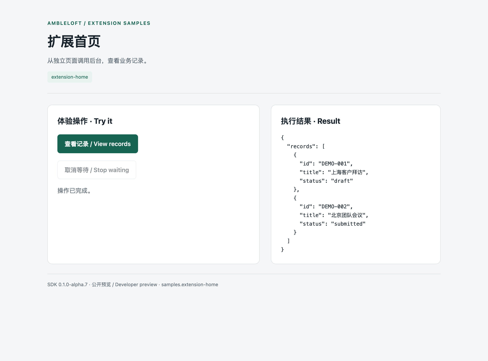

# Extension home

**English** · [简体中文](README.zh-CN.md)

Read business records through the extension page bridge.


**Surface: independent extension home.** This example uses the SDK webview bridge, not a chat iframe. For a custom page inside chat, see `mcp-apps-card`.

[Compare both approaches and screenshots](../docs/chat-ui-rendering.md).

## Run

Requires Node.js ≥22.13 and an Ambleloft host with extension support. SDK/CLI are installed from npm, pinned to `0.1.0-alpha.7`; no adjacent source repository is needed.

```sh
cd extension-home
npm ci
npm run build
npm run validate
npm test
npm run pack
```

In host **Settings → Extensions → Install**, choose `dist/extension-home.amble-extension`, trust it, grant the declared permissions, and open its home where available. Extension ID: `samples.extension-home`.

## Walkthrough

Follow the labeled controls on the extension home using fictional sample data. The result area shows the actual operation response.

## Screenshots and verification

Captured from the real Ambleloft desktop on macOS with an isolated profile, fictional data, local demo services, and a deterministic fixture model. Extension page images come from actual isolated WebContents; forms and messages come from the host window. These are not design mockups or browser mocks.



Extension home running in the real host.

[Full verification and remaining gaps](../docs/verification.md). The sample remains preview; screenshots do not imply all platforms and failure modes have passed.

## Permissions and implementation

`none / 无`

Project permissions are scoped to the user-selected project; storage/configuration/secrets are extension-local. Declaration is not a grant. The Node backend uses the public SDK; the independent extension home uses the webview bridge. This example has no chat iframe.

| Operation | Handler | Effect | Caller |
| --- | --- | --- | --- |
| `samples.extension-home.list` | `list` | read | page, agent |

## Errors, limits, and cleanup

Cancelling confirmation prevents dispatch. Cancelling waiting is not rollback; reconcile unknown results before any new write. Refused permissions must fail; new permissions require a new user grant.

These are alpha previews. Form YAML and some demo controls are Chinese; bilingual docs do not imply automatic form localization. Enterprise authentication needs a deployed IdP. Messages are local; remind is not an OS delivery receipt.

Disable/uninstall in extension settings and choose whether to retain data. Stop standalone services with Ctrl+C. Delete only your own demo SQLite files after stopping the service; never remove a real user profile.
