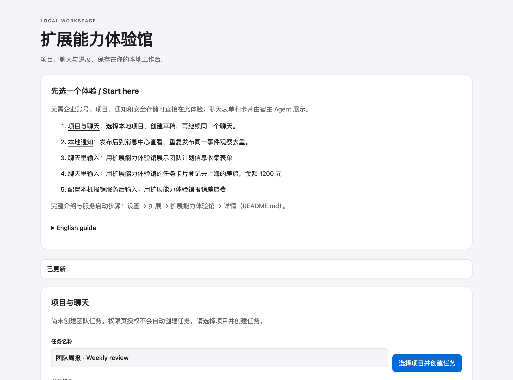

# 扩展能力体验馆

[English](README.md) · **简体中文**

体验项目、表单、消息、业务操作和企业连接。

## 运行

需要 Node.js ≥22.13 和支持扩展的 Ambleloft。SDK/CLI 从 npm 安装，版本固定为 `0.1.0-alpha.7`，无需相邻源码仓库。

```sh
cd extension-showcase
npm ci
npm run build
npm run validate
npm test
npm run pack
```

在宿主 **设置 → 扩展 → 安装扩展** 选择 `dist/extension-showcase.amble-extension`，信任后按提示授权，再打开扩展首页。安装包 ID 为 `samples.extension-showcase`。

## 体验步骤

在扩展首页按按钮名称依次体验；输入使用虚构示例数据，结果区显示实际 Operation 返回值。

[详细操作与服务说明](GUIDE.zh-CN.md)。

## 截图与验证

以下图片采集自 macOS 上的真实 Ambleloft 桌面，使用隔离 profile、虚构数据、本机模拟服务和确定性模拟模型。扩展页面截图来自实际隔离 WebContents；表单和消息截图来自宿主窗口。它们不是设计稿或浏览器 mock。



真实宿主中的扩展首页。

[完整验证记录与未覆盖项](../docs/verification.md)。本案例仍标记为 preview，截图不代表所有平台和所有异常均验收完成。

## 权限与实现

`projects.read, projects.path.read, conversations.create, conversations.open, storage, configuration, secrets`

项目权限限定到用户授权项目；storage/configuration/secrets 为扩展自身。声明权限不等于已获授权。Node 后台使用公开 SDK，页面通过宿主桥调用；MCP Apps 卡片使用独立任务 UI 协议。

| Operation | Handler | Effect | Caller |
| --- | --- | --- | --- |
| `samples.extension-showcase.status` | `status` | read | page |
| `samples.extension-showcase.addTask` | `addTask` | write | page, agent |
| `samples.extension-showcase.removeTask` | `removeTask` | write | page |
| `samples.extension-showcase.createChat` | `createChat` | write | page |
| `samples.extension-showcase.openChat` | `openChat` | read | page |
| `samples.extension-showcase.unlinkChat` | `unlinkChat` | write | page |
| `samples.extension-showcase.acknowledgeUnknown` | `acknowledgeUnknown` | write | page |
| `samples.extension-showcase.summary` | `summary` | read | page, agent |
| `samples.extension-showcase.projectPath` | `projectPath` | read | page, agent |
| `samples.extension-showcase.publish` | `publish` | write | page |
| `samples.extension-showcase.query` | `query` | read | page |
| `samples.extension-showcase.update` | `update` | write | page |
| `samples.extension-showcase.withdraw` | `withdraw` | write | page |
| `samples.extension-showcase.preferences` | `preferences` | read | page |
| `samples.extension-showcase.connection` | `connection` | write | page |
| `samples.extension-showcase.secretStatus` | `secretStatus` | read | page |
| `samples.extension-showcase.secretDelete` | `secretDelete` | write | page |
| `samples.extension-showcase.kvCheck` | `kvCheck` | write | page |
| `samples.extension-showcase.saveDraft` | `saveDraft` | write | page |
| `samples.extension-showcase.lookupDraft` | `lookupDraft` | read | page |
| `samples.extension-showcase.submitExpense` | `submitExpense` | write | page |
| `samples.extension-showcase.lookupExpense` | `lookupExpense` | read | page |
| `samples.extension-showcase.cardRender` | `cardRender` | read | agent |
| `samples.extension-showcase.cardSave` | `cardSave` | write | page |
| `samples.extension-showcase.actionPublish` | `actionPublish` | write | page |
| `samples.extension-showcase.actionRun` | `actionRun` | write | page |
| `samples.extension-showcase.actionRecords` | `actionRecords` | read | page |
| `samples.extension-showcase.actionReconcile` | `actionReconcile` | write | page |
| `samples.extension-showcase.authStatus` | `authStatus` | read | page |
| `samples.extension-showcase.authConnect` | `authConnect` | read | page |
| `samples.extension-showcase.authDisconnect` | `authDisconnect` | write | page |
| `samples.extension-showcase.authRequest` | `authRequest` | read | page |

## 错误、限制与清理

取消确认不会派发该写入；取消等待不等于回滚，结果未知时先查询，不自动重试写入。拒绝授权后相关操作应失败；修改权限后由用户重新授权。

扩展为 alpha 预览。表单 YAML 和部分演示控件使用中文；不要把双语文档理解为所有表单自动本地化。企业认证需要实际 IdP；消息仅本地作用域，remind 不是系统送达回执。

在扩展设置停用/卸载；数据是否清除由用户选择。独立服务用 Ctrl+C 停止。只在停服后删除自己创建的演示 SQLite 数据；不要清理真实用户 profile。
