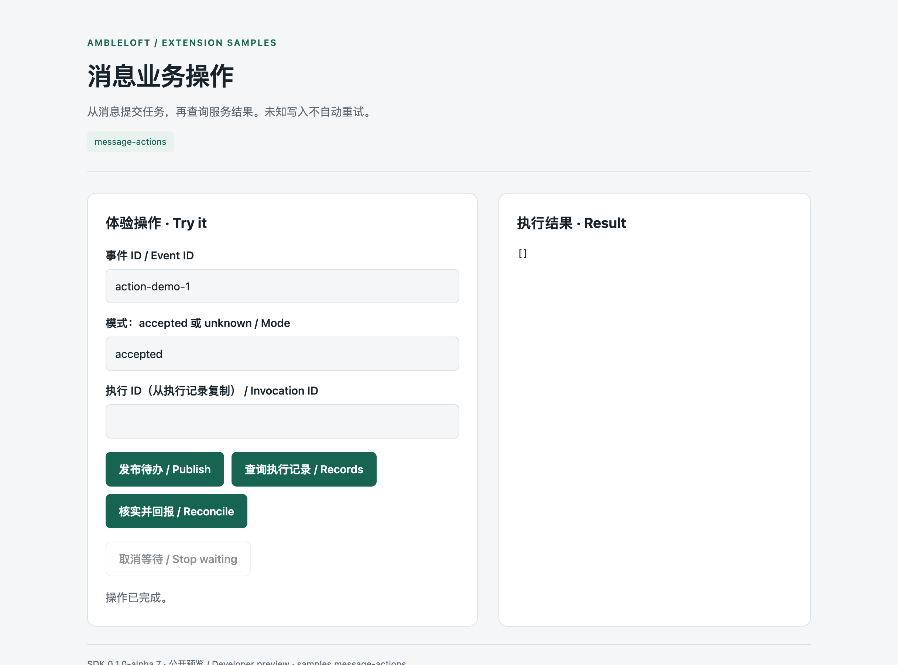
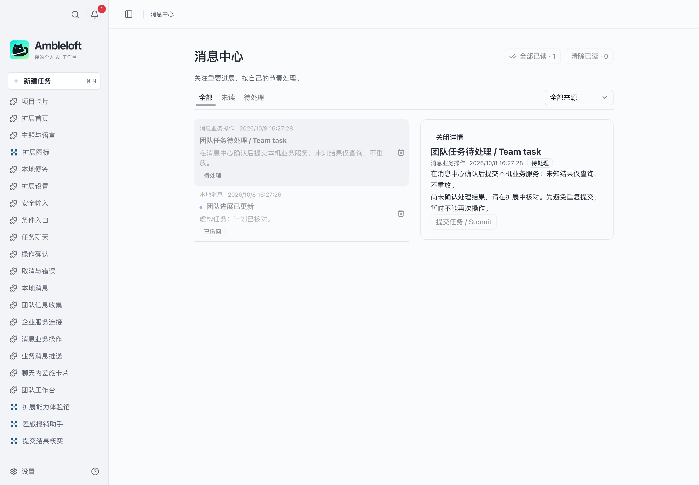
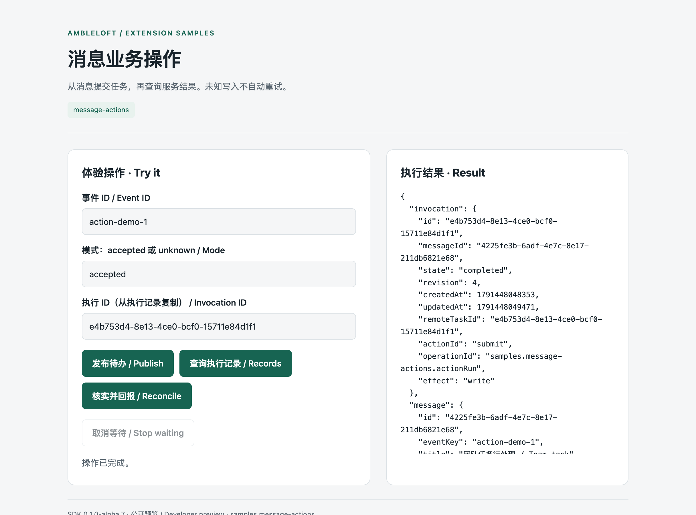

# Message actions

**English** · [简体中文](README.zh-CN.md)

Submit from a notification and reconcile its result without repeating a write.

## Run

Requires Node.js ≥22.13 and an Ambleloft host with extension support. SDK/CLI are installed from npm, pinned to `0.1.0-alpha.7`; no adjacent source repository is needed.

```sh
cd message-actions
npm ci
npm run build
npm run validate
npm test
npm run pack
```

In host **Settings → Extensions → Install**, choose `dist/message-actions.amble-extension`, trust it, grant the declared permissions, and open its home where available. Extension ID: `samples.message-actions`.

## Walkthrough

Run `npm run service`, set actionServiceUrl to `http://127.0.0.1:47833`, publish a notification, and confirm its Submit action in the message center. Query records, copy the invocation ID, keep the original eventKey, and reconcile. Unknown mode drops the response after persistence; reconciliation never resubmits.

## Screenshots and verification

Captured from the real Ambleloft desktop on macOS with an isolated profile, fictional data, local demo services, and a deterministic fixture model. Extension page images come from actual isolated WebContents; forms and messages come from the host window. These are not design mockups or browser mocks.



Extension home running in the real host.



The message action loses its response; the host retains unknown and blocks another write.



Reporting completed after querying the business result; only one business write occurred.

[Full verification and remaining gaps](../docs/verification.md). The sample remains preview; screenshots do not imply all platforms and failure modes have passed.

## Permissions and implementation

`configuration`

Project permissions are scoped to the user-selected project; storage/configuration/secrets are extension-local. Declaration is not a grant. Node uses the public SDK; pages use the host bridge. MCP Apps has a separate task UI protocol.

| Operation | Handler | Effect | Caller |
| --- | --- | --- | --- |
| `samples.message-actions.actionPublish` | `actionPublish` | write | page |
| `samples.message-actions.actionRecords` | `actionRecords` | read | page |
| `samples.message-actions.actionRun` | `actionRun` | write | page |
| `samples.message-actions.actionReconcile` | `actionReconcile` | write | page |

## Errors, limits, and cleanup

Cancelling confirmation prevents dispatch. Cancelling waiting is not rollback; reconcile unknown results before any new write. Refused permissions must fail; new permissions require a new user grant.

These are alpha previews. Form YAML and some demo controls are Chinese; bilingual docs do not imply automatic form localization. Enterprise authentication needs a deployed IdP. Messages are local; remind is not an OS delivery receipt.

Disable/uninstall in extension settings and choose whether to retain data. Stop standalone services with Ctrl+C. Delete only your own demo SQLite files after stopping the service; never remove a real user profile.

```sh
# accepted -> completed: use the invocation ID shown in records
curl http://127.0.0.1:47833/complete -H 'content-type: application/json' -d '{"id":"REPLACE_WITH_INVOCATION_ID"}'
```
