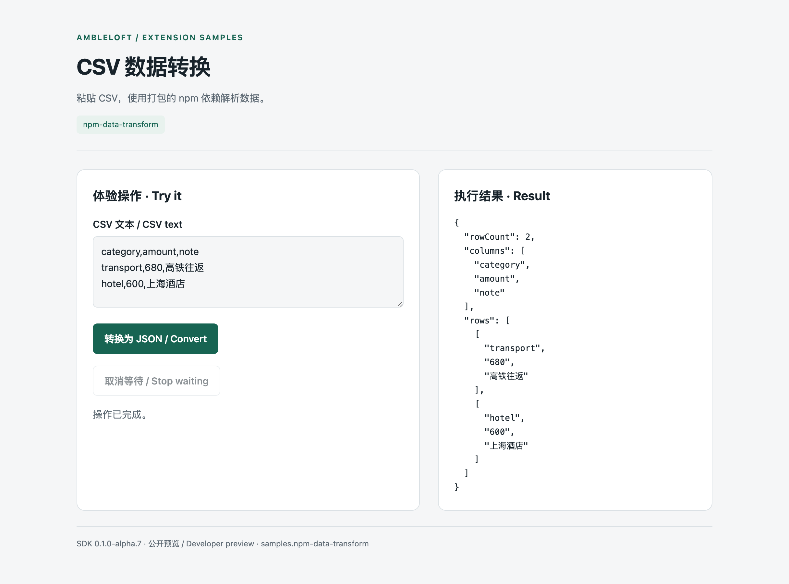

# CSV 数据转换

[English](README.md) · **简体中文**

粘贴 CSV，使用打包的 npm 依赖解析数据。

## 运行

需要 Node.js ≥22.13 和支持扩展的 Ambleloft。SDK/CLI 从 npm 安装，版本固定为 `0.1.0-alpha.7`，无需相邻源码仓库。

```sh
cd npm-data-transform
npm ci
npm run build
npm run validate
npm test
npm run pack
```

在宿主 **设置 → 扩展 → 安装扩展** 选择 `dist/npm-data-transform.amble-extension`，信任后按提示授权，再打开扩展首页。安装包 ID 为 `samples.npm-data-transform`。

## 体验步骤

在扩展首页按按钮名称依次体验；输入使用虚构示例数据，结果区显示实际 Operation 返回值。

## 截图与验证

以下图片采集自 macOS 上的真实 Ambleloft 桌面，使用隔离 profile、虚构数据、本机模拟服务和确定性模拟模型。扩展页面截图来自实际隔离 WebContents；表单和消息截图来自宿主窗口。它们不是设计稿或浏览器 mock。



真实宿主中的扩展首页。

[完整验证记录与未覆盖项](../docs/verification.md)。本案例仍标记为 preview，截图不代表所有平台和所有异常均验收完成。

## 权限与实现

`none / 无`

项目权限限定到用户授权项目；storage/configuration/secrets 为扩展自身。声明权限不等于已获授权。Node 后台使用公开 SDK，页面通过宿主桥调用；MCP Apps 卡片使用独立任务 UI 协议。

| Operation | Handler | Effect | Caller |
| --- | --- | --- | --- |
| `samples.npm-data-transform.parse` | `parse` | read | page, agent |

## 错误、限制与清理

取消确认不会派发该写入；取消等待不等于回滚，结果未知时先查询，不自动重试写入。拒绝授权后相关操作应失败；修改权限后由用户重新授权。

扩展为 alpha 预览。表单 YAML 和部分演示控件使用中文；不要把双语文档理解为所有表单自动本地化。企业认证需要实际 IdP；消息仅本地作用域，remind 不是系统送达回执。

在扩展设置停用/卸载；数据是否清除由用户选择。独立服务用 Ctrl+C 停止。只在停服后删除自己创建的演示 SQLite 数据；不要清理真实用户 profile。

输出使用 columns 与 rows 数组，保留 CSV 字符串值，不自动推断金额或日期类型。解析依赖 csv-parse 7.0.3 随包打入，安装后本地转换不需要网络。
