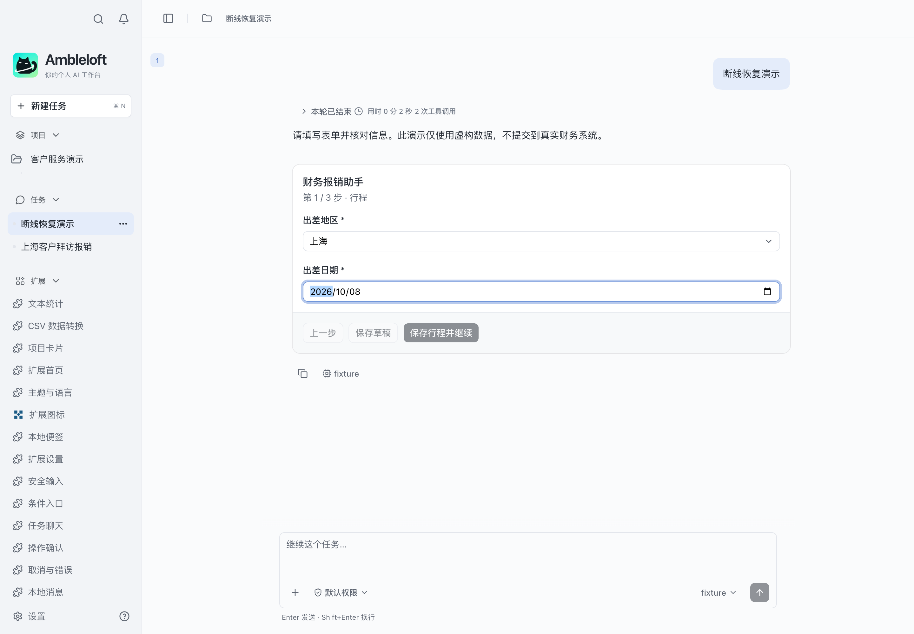
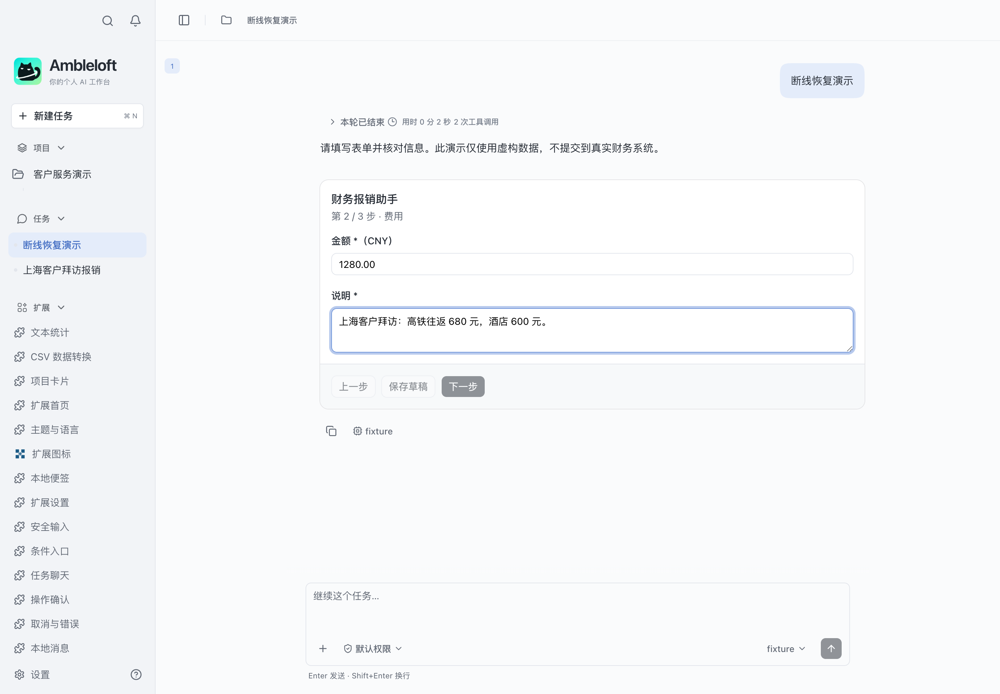
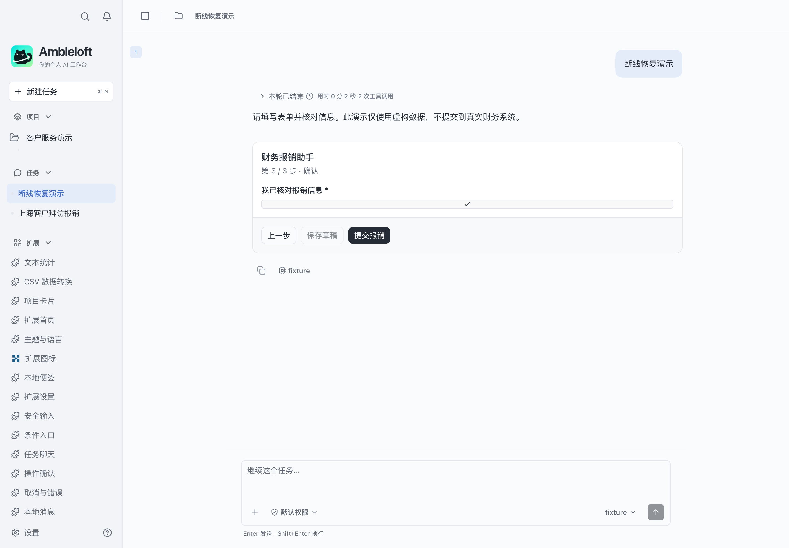
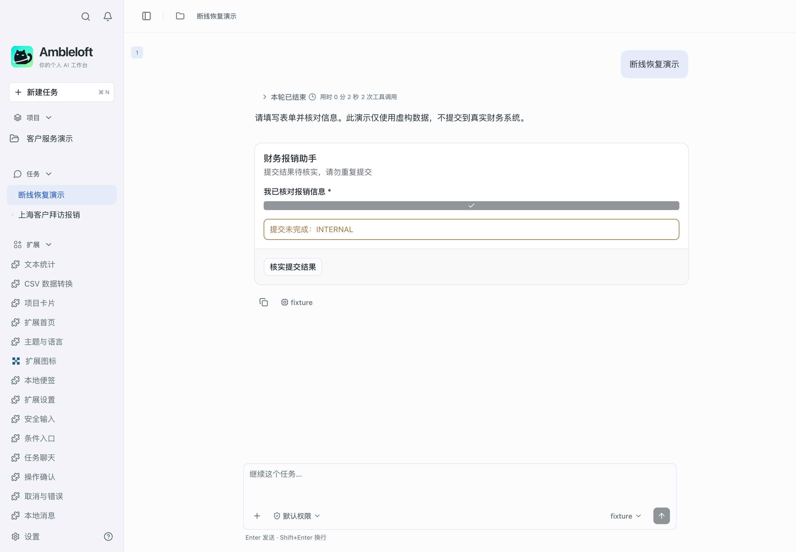
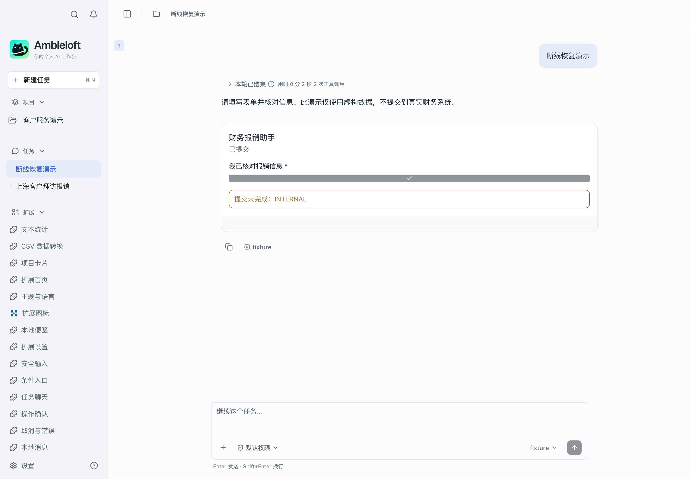

# Submission recovery

**English** · [简体中文](README.zh-CN.md)

Drop a write response and reconcile the original submission without replay.

## Run

Requires Node.js ≥22.13 and an Ambleloft host with extension support. SDK/CLI are installed from npm, pinned to `0.1.0-alpha.7`; no adjacent source repository is needed.

```sh
cd submission-recovery
npm ci
npm run build
npm run validate
npm test
npm run pack
```

In host **Settings → Extensions → Install**, choose `dist/submission-recovery.amble-extension`, trust it, grant the declared permissions, and open its home where available. Extension ID: `samples.submission-recovery`.

## Walkthrough

Run `npm run service`, set `serviceUrl=http://127.0.0.1:47832`, and ask the agent to present this extension’s travel form. Inject the dropped response below and reconcile from the original form. Do not start this and expense-workflow on the same port.

## Screenshots and verification

Captured from the real Ambleloft desktop on macOS with an isolated profile, fictional data, local demo services, and a deterministic fixture model. Extension page images come from actual isolated WebContents; forms and messages come from the host window. These are not design mockups or browser mocks.


Extension home running in the real host.



Step 1: review destination and date, then confirm saving the business draft.



Step 2: enter CNY 1,280.00 and explain the costs.



Step 3: explicitly review and submit.



Intentionally dropped response: the form remains unknown and never automatically resubmits.



Reconciliation changes the status to submitted; ledger assertions confirm one claim. The host still displays the stale error; see known gaps.

[Full verification and remaining gaps](../docs/verification.md). The sample remains preview; screenshots do not imply all platforms and failure modes have passed.

## Permissions and implementation

`configuration`

Project permissions are scoped to the user-selected project; storage/configuration/secrets are extension-local. Declaration is not a grant. Node uses the public SDK; pages use the host bridge. MCP Apps has a separate task UI protocol.

| Operation | Handler | Effect | Caller |
| --- | --- | --- | --- |
| `samples.submission-recovery.saveDraft` | `saveDraft` | write | page |
| `samples.submission-recovery.lookupDraft` | `lookupDraft` | read | page |
| `samples.submission-recovery.submitExpense` | `submitExpense` | write | page |
| `samples.submission-recovery.lookupExpense` | `lookupExpense` | read | page |
| `samples.submission-recovery.status` | `status` | read | page, agent |
| `samples.submission-recovery.records` | `records` | read | page, agent |

## Errors, limits, and cleanup

Cancelling confirmation prevents dispatch. Cancelling waiting is not rollback; reconcile unknown results before any new write. Refused permissions must fail; new permissions require a new user grant.

These are alpha previews. Form YAML and some demo controls are Chinese; bilingual docs do not imply automatic form localization. Enterprise authentication needs a deployed IdP. Messages are local; remind is not an OS delivery receipt.

Disable/uninstall in extension settings and choose whether to retain data. Stop standalone services with Ctrl+C. Delete only your own demo SQLite files after stopping the service; never remove a real user profile.

## Drop-after-write recovery

Before final submission, run the following command. The service persists the claim and drops its response. Use Check submission result in the original form: the same claim ID must return and the ledger must show exactly one new claim.

```sh
curl http://127.0.0.1:47832/control -H 'content-type: application/json' -d '{"operation":"submitExpense","mode":"drop"}'
curl http://127.0.0.1:47832/ledger
# Restore normal service behavior / 恢复正常模式
curl http://127.0.0.1:47832/control -H 'content-type: application/json' -d '{"operation":"submitExpense","mode":"normal"}'
```

This delivery targets F0/F1: three-step forms, service health, read-only records, and recovery. Expense progress notifications/actions and enterprise service adaptation are not integrated into this sample yet; see the separate capability samples. No attachments, OCR, dynamic fields, payment, or automatic approval.

Known host limitations / 宿主已知限制：[docs/gaps.md](../docs/gaps.md)。
