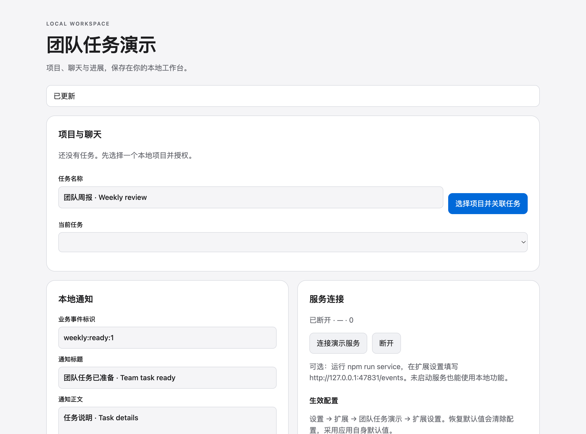

# Team workbench

**English** · [简体中文](README.zh-CN.md)

Connect projects, tasks, and conversations to continue your work.

## Run

Requires Node.js ≥22.13 and an Ambleloft host with extension support. SDK/CLI are installed from npm, pinned to `0.1.0-alpha.7`; no adjacent source repository is needed.

```sh
cd team-workbench
npm ci
npm run build
npm run validate
npm test
npm run pack
```

In host **Settings → Extensions → Install**, choose `dist/team-workbench.amble-extension`, trust it, grant the declared permissions, and open its home where available. Extension ID: `samples.team-workbench`.

## Walkthrough

Follow the labeled controls on the extension home using fictional sample data. The result area shows the actual operation response.

See the [detailed service walkthrough (Chinese)](GUIDE.zh-CN.md). Services are optional and separately started; basic project/task features do not require an enterprise account.

## Screenshots and verification

Captured from the real Ambleloft desktop on macOS with an isolated profile, fictional data, local demo services, and a deterministic fixture model. Extension page images come from actual isolated WebContents; forms and messages come from the host window. These are not design mockups or browser mocks.



Extension home running in the real host.

[Full verification and remaining gaps](../docs/verification.md). The sample remains preview; screenshots do not imply all platforms and failure modes have passed.

## Permissions and implementation

`projects.read, projects.path.read, conversations.create, conversations.open, storage, configuration, secrets`

Project permissions are scoped to the user-selected project; storage/configuration/secrets are extension-local. Declaration is not a grant. Node uses the public SDK; pages use the host bridge. MCP Apps has a separate task UI protocol.

| Operation | Handler | Effect | Caller |
| --- | --- | --- | --- |
| `samples.team-workbench.status` | `status` | read | page |
| `samples.team-workbench.addTask` | `addTask` | write | page, agent |
| `samples.team-workbench.removeTask` | `removeTask` | write | page |
| `samples.team-workbench.createChat` | `createChat` | write | page |
| `samples.team-workbench.openChat` | `openChat` | read | page |
| `samples.team-workbench.unlinkChat` | `unlinkChat` | write | page |
| `samples.team-workbench.acknowledgeUnknown` | `acknowledgeUnknown` | write | page |
| `samples.team-workbench.summary` | `summary` | read | page, agent |
| `samples.team-workbench.projectPath` | `projectPath` | read | page, agent |
| `samples.team-workbench.publish` | `publish` | write | page |
| `samples.team-workbench.query` | `query` | read | page |
| `samples.team-workbench.update` | `update` | write | page |
| `samples.team-workbench.withdraw` | `withdraw` | write | page |
| `samples.team-workbench.preferences` | `preferences` | read | page |
| `samples.team-workbench.connection` | `connection` | write | page |
| `samples.team-workbench.secretStatus` | `secretStatus` | read | page |
| `samples.team-workbench.secretDelete` | `secretDelete` | write | page |
| `samples.team-workbench.kvCheck` | `kvCheck` | write | page |
| `samples.team-workbench.delay` | `delay` | write | page |
| `samples.team-workbench.messageProbe` | `messageProbe` | write | page |
| `samples.team-workbench.resourceProbe` | `resourceProbe` | read | page, agent |
| `samples.team-workbench.listenerProbe` | `listenerProbe` | write | page |
| `samples.team-workbench.crashProbe` | `crashProbe` | write | page |
| `samples.team-workbench.rpcProbe` | `rpcProbe` | read | page |

## Errors, limits, and cleanup

Cancelling confirmation prevents dispatch. Cancelling waiting is not rollback; reconcile unknown results before any new write. Refused permissions must fail; new permissions require a new user grant.

These are alpha previews. Form YAML and some demo controls are Chinese; bilingual docs do not imply automatic form localization. Enterprise authentication needs a deployed IdP. Messages are local; remind is not an OS delivery receipt.

Disable/uninstall in extension settings and choose whether to retain data. Stop standalone services with Ctrl+C. Delete only your own demo SQLite files after stopping the service; never remove a real user profile.
