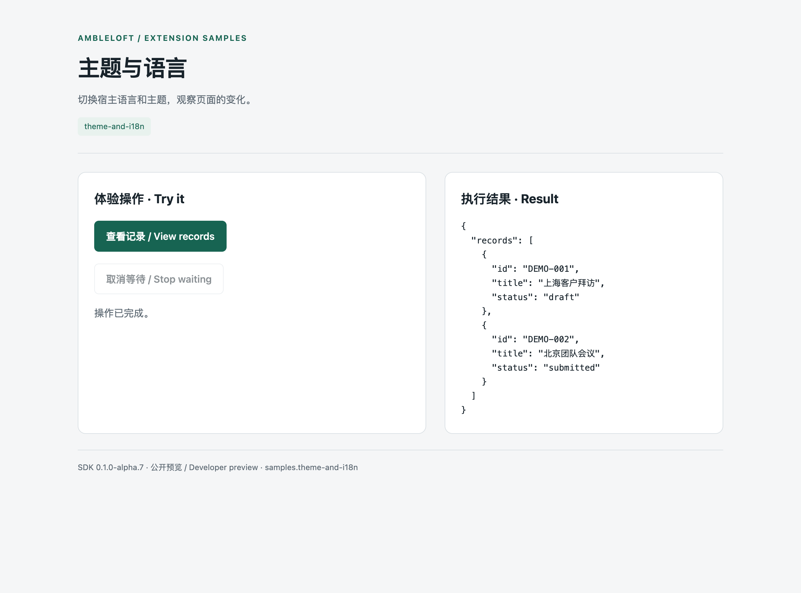
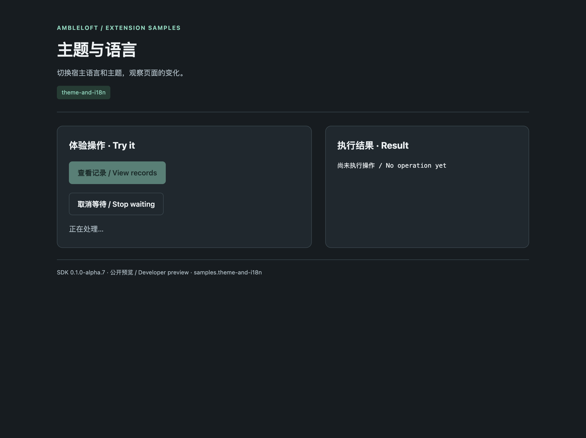
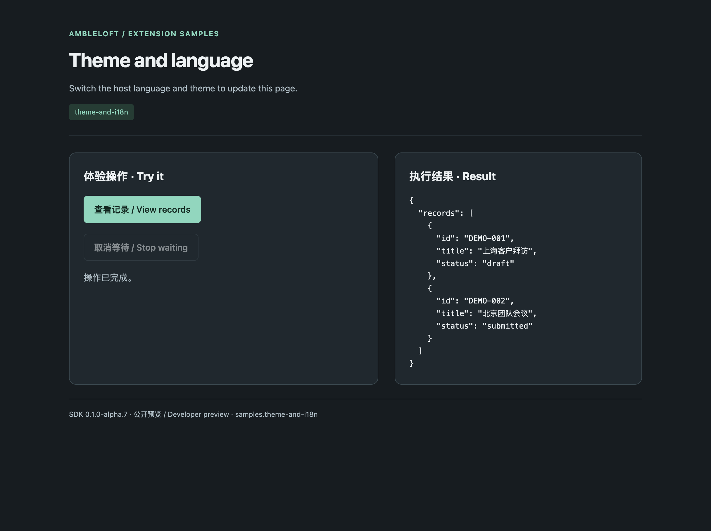

# Theme and language

**English** · [简体中文](README.zh-CN.md)

Switch the host language and theme to update this page.

## Run

Requires Node.js ≥22.13 and an Ambleloft host with extension support. SDK/CLI are installed from npm, pinned to `0.1.0-alpha.7`; no adjacent source repository is needed.

```sh
cd theme-and-i18n
npm ci
npm run build
npm run validate
npm test
npm run pack
```

In host **Settings → Extensions → Install**, choose `dist/theme-and-i18n.amble-extension`, trust it, grant the declared permissions, and open its home where available. Extension ID: `samples.theme-and-i18n`.

## Walkthrough

Follow the labeled controls on the extension home using fictional sample data. The result area shows the actual operation response.

## Screenshots and verification

Captured from the real Ambleloft desktop on macOS with an isolated profile, fictional data, local demo services, and a deterministic fixture model. Extension page images come from actual isolated WebContents; forms and messages come from the host window. These are not design mockups or browser mocks.



Extension home running in the real host.



Dark appearance follows the host.



The page responds to the host language change and retains dark appearance.

[Full verification and remaining gaps](../docs/verification.md). The sample remains preview; screenshots do not imply all platforms and failure modes have passed.

## Permissions and implementation

`none / 无`

Project permissions are scoped to the user-selected project; storage/configuration/secrets are extension-local. Declaration is not a grant. Node uses the public SDK; pages use the host bridge. MCP Apps has a separate task UI protocol.

| Operation | Handler | Effect | Caller |
| --- | --- | --- | --- |
| `samples.theme-and-i18n.list` | `list` | read | page, agent |

## Errors, limits, and cleanup

Cancelling confirmation prevents dispatch. Cancelling waiting is not rollback; reconcile unknown results before any new write. Refused permissions must fail; new permissions require a new user grant.

These are alpha previews. Form YAML and some demo controls are Chinese; bilingual docs do not imply automatic form localization. Enterprise authentication needs a deployed IdP. Messages are local; remind is not an OS delivery receipt.

Disable/uninstall in extension settings and choose whether to retain data. Stop standalone services with Ctrl+C. Delete only your own demo SQLite files after stopping the service; never remove a real user profile.
